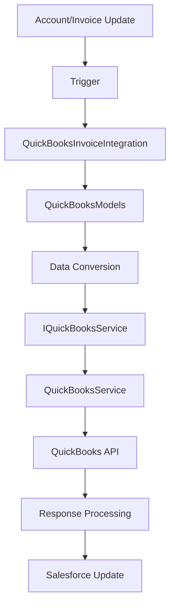

# QuickBooks Integration - Service Architecture Guide

## 🏗️ Architecture Overview

The QuickBooks integration has been refactored to use a clean service architecture pattern that separates concerns and improves testability. This design follows SOLID principles and makes the code more maintainable and extensible.

## 📁 Component Structure

### **Core Components**

```
QuickBooks Integration Architecture
├── 🔌 IQuickBooksService (Interface)
├── 🛠️ QuickBooksService (HTTP Implementation)
├── 🎭 QuickBooksMockService (Test Implementation)
├── 📊 QuickBooksModels (Data Models)
├── 🧠 QuickBooksInvoiceIntegration (Business Logic)
└── 🎯 AccountTrigger (Event Handlers)
```

---

## 🔌 Interface Layer: `IQuickBooksService`

**Purpose**: Defines the contract for QuickBooks API operations

**Key Methods**:
- `syncCustomer(QuickBooksModels.QBCustomer)` - Create or update customer
- `findCustomerByName(String)` - Search for existing customer
- `createInvoice(QuickBooksModels.QBInvoice)` - Create new invoice
- `updateInvoice(QuickBooksModels.QBInvoice)` - Update existing invoice
- `deleteInvoice(String)` - Delete invoice
- `getRealmId()` - Get company realm ID
- `testConnection()` - Test API connectivity

**Benefits**:
- ✅ Enables dependency injection
- ✅ Supports multiple implementations
- ✅ Makes testing easier with mocks
- ✅ Follows interface segregation principle

---

## 🛠️ Service Implementation: `QuickBooksService`

**Purpose**: Contains all HTTP logic for QuickBooks API communication

**Key Features**:
- **HTTP Request Handling**: All callouts to QuickBooks API
- **Error Management**: Comprehensive error handling and logging
- **Authentication**: Uses named credential `QuickBooks_NC`
- **Data Transformation**: JSON serialization/deserialization
- **SyncToken Management**: Handles QuickBooks versioning

**Configuration**:
```apex
private static final String QB_BASE_URL = 'callout:QuickBooks_NC/v3/company/';
private static final String REALM_ID = '9341454816381446';
```

**Benefits**:
- ✅ Single responsibility for HTTP operations
- ✅ Centralized error handling
- ✅ Easy to modify API endpoints
- ✅ Proper separation of concerns

---

## 🎭 Mock Service: `QuickBooksMockService`

**Purpose**: Test implementation that simulates QuickBooks API without HTTP calls

**Usage in Tests**:
```apex
// Set up mock for success scenarios
QuickBooksInvoiceIntegration.setService(new QuickBooksMockService(false, null));

// Set up mock for failure scenarios  
QuickBooksInvoiceIntegration.setService(new QuickBooksMockService(true, 'Custom error'));
```

**Benefits**:
- ✅ No HTTP calls during testing
- ✅ Predictable test results
- ✅ Fast test execution
- ✅ Easy to simulate error conditions

---

## 📊 Data Models: `QuickBooksModels`

**Purpose**: Centralized data structures and conversion utilities

**Key Classes**:
- `QBInvoice` - QuickBooks invoice structure
- `QBCustomer` - QuickBooks customer structure
- `QBAddress` - Address information
- `QBLineItem` - Invoice line items
- `QBCustomerRef` - Customer references

**Conversion Utilities**:
- `convertAccountToCustomer(Account)` - Salesforce Account → QB Customer
- `convertSalesforceInvoice(SObject, Account, String)` - SF Invoice → QB Invoice

**Benefits**:
- ✅ Centralized data structures
- ✅ Reusable conversion logic
- ✅ Type safety
- ✅ Easy to maintain field mappings

---

## 🧠 Business Logic: `QuickBooksInvoiceIntegration`

**Purpose**: Orchestrates business operations and workflows

**Core Responsibilities**:
- **Workflow Orchestration**: Manages sync processes
- **Data Validation**: Ensures data integrity
- **Salesforce Updates**: Updates records with QuickBooks IDs
- **Batch Processing**: Handles multiple records
- **Error Recovery**: Manages failures gracefully

**Key Methods**:
```apex
// Public API Methods
syncInvoiceToQuickBooks(Id invoiceId)
batchSyncInvoicesToQuickBooks(List<Id> invoiceIds)
syncInvoicesAsync(Set<Id> invoiceIds)
ensureCustomerExists(Account account)
testQuickBooksConnection()
```

**Benefits**:
- ✅ Clean separation from HTTP logic
- ✅ Focused on business rules
- ✅ Easy to test business logic
- ✅ Dependency injection support

---

## 🎯 Event Handling: `AccountTrigger`

**Purpose**: Automatically detects customer accounts for syncing

**Trigger Logic**:
```apex
// Sync if account type contains 'customer'
if (String.isNotBlank(acc.Type) && acc.Type.toLowerCase().contains('customer'))

// Sync if account name contains 'customer'  
if (String.isNotBlank(acc.Name) && acc.Name.toLowerCase().contains('customer'))

// Sync if customer fields changed
if (fieldsChanged) { accountsToSync.add(acc.Id); }
```

**Benefits**:
- ✅ Automatic customer sync
- ✅ Real-time updates
- ✅ Field-level change detection
- ✅ Bulk operation support

---

## 🔄 Data Flow Architecture



**Flow Steps**:
1. **Trigger Event**: Account/Invoice changes detected
2. **Business Logic**: Integration class validates and prepares data
3. **Data Conversion**: Models convert Salesforce data to QuickBooks format
4. **Service Call**: HTTP service makes API request
5. **Response Handling**: Success/error responses processed
6. **Salesforce Update**: Records updated with QuickBooks IDs

---

## 🧪 Testing Strategy

### **Unit Testing with Mocks**
```apex
@isTest
static void testCustomerSync() {
    // Arrange
    QuickBooksInvoiceIntegration.setService(new QuickBooksMockService());
    Account testAccount = createTestAccount();
    
    // Act
    String result = QuickBooksInvoiceIntegration.ensureCustomerExists(testAccount);
    
    // Assert
    System.assert(!result.startsWith('Error:'));
}
```

### **Integration Testing**
```apex
// Use real service for integration tests
QuickBooksInvoiceIntegration.setService(new QuickBooksService());
Boolean connected = QuickBooksInvoiceIntegration.testQuickBooksConnection();
```

### **Error Scenario Testing**
```apex
// Test failure scenarios
QuickBooksInvoiceIntegration.setService(new QuickBooksMockService(true, 'API Error'));
String result = QuickBooksInvoiceIntegration.ensureCustomerExists(account);
System.assert(result.startsWith('Error:'));
```

---

## 🎨 Design Patterns Used

### **1. Service Pattern**
- Encapsulates HTTP operations in dedicated service
- Separates business logic from infrastructure concerns

### **2. Interface Segregation**
- Small, focused interface defining only necessary operations
- Enables multiple implementations (real, mock, test)

### **3. Dependency Injection**
- Service can be swapped at runtime
- Enables testing without external dependencies

### **4. Factory Pattern**
- Models class provides factory methods for data conversion
- Centralizes object creation logic

### **5. Template Method**
- Common sync workflow with specific implementations
- Consistent error handling across operations

---

## 🚀 Deployment Benefits

### **Development Benefits**
- ✅ **Faster Development**: Clear separation of concerns
- ✅ **Easier Testing**: Mock services eliminate HTTP dependencies
- ✅ **Better Debugging**: Isolated components easier to troubleshoot
- ✅ **Code Reuse**: Models and services can be reused

### **Production Benefits**
- ✅ **Better Performance**: Optimized HTTP operations
- ✅ **Improved Reliability**: Better error handling and recovery
- ✅ **Easier Maintenance**: Modular architecture
- ✅ **Scalability**: Service can be enhanced without changing business logic

### **Testing Benefits**
- ✅ **No HTTP Calls**: Tests run without external dependencies
- ✅ **Predictable Results**: Mock responses ensure consistent testing
- ✅ **Fast Execution**: No network delays in test runs
- ✅ **Coverage**: Easy to achieve high test coverage

---

## 📈 Performance Improvements

### **Before (Monolithic)**
- Mixed business and HTTP logic
- Difficult to test without HTTP calls
- Tight coupling between components
- Hard to modify individual operations

### **After (Service Architecture)**
- Clean separation of concerns
- Easy mocking for fast tests
- Loose coupling via interfaces
- Independent component modification

---

## 🔧 Extension Points

### **Adding New QuickBooks Operations**
1. Add method to `IQuickBooksService` interface
2. Implement in `QuickBooksService` 
3. Add mock implementation in `QuickBooksMockService`
4. Create business logic method in integration class

### **Supporting Multiple QuickBooks Companies**
```apex
// Create realm-specific services
IQuickBooksService company1Service = new QuickBooksService('realm1');
IQuickBooksService company2Service = new QuickBooksService('realm2');
```

### **Adding New Data Types**
1. Add data models to `QuickBooksModels`
2. Create conversion methods
3. Add service methods for new operations
4. Implement business logic

---

## 🎯 Best Practices

### **Service Implementation**
- ✅ Always return consistent error format
- ✅ Use comprehensive logging
- ✅ Handle all HTTP status codes
- ✅ Implement proper timeouts

### **Business Logic**
- ✅ Validate data before service calls
- ✅ Use transactions for related operations
- ✅ Implement retry logic for transient failures
- ✅ Update Salesforce records after successful sync

### **Testing**
- ✅ Test both success and failure scenarios
- ✅ Use mocks for unit tests
- ✅ Test error handling thoroughly
- ✅ Verify Salesforce record updates

---

## 🎉 Migration Benefits Summary

| Aspect | Before | After |
|--------|--------|-------|
| **Architecture** | Monolithic | Service-based |
| **Testing** | HTTP calls required | Mock services |
| **Maintainability** | Tightly coupled | Loosely coupled |
| **Extensibility** | Difficult | Easy |
| **Performance** | Mixed concerns | Optimized layers |
| **Debugging** | Complex | Isolated components |

The refactored service architecture provides a solid foundation for QuickBooks integration that is testable, maintainable, and ready for production use!